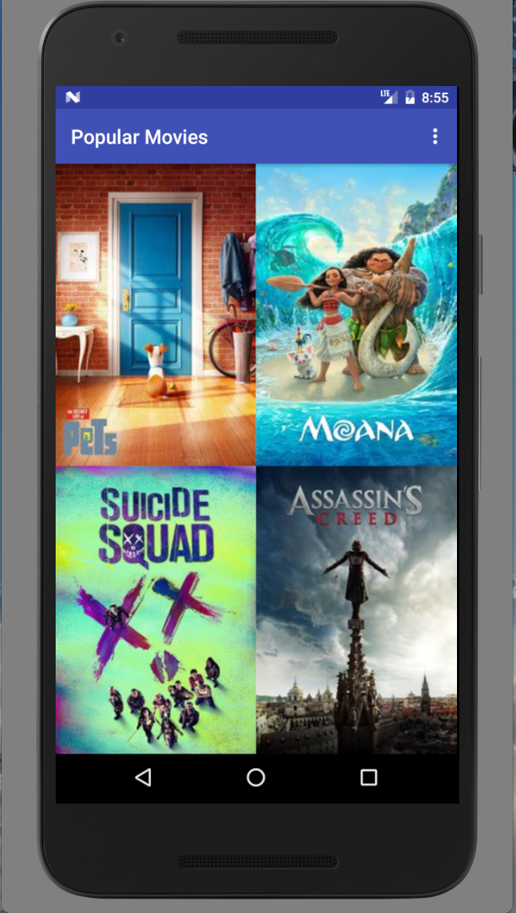

Popular Movies
==================

A simple Android app that let user discover movies from The Movie Database.
This is Project 1 of Udacity's Associate Android Developer Fast Track Program.

**Features:**

- Discover the most popular and the highest rated movies
- Read movie details such as release date, movie rate, and synopsis
- Offline work

Screenshots
-----------




Developer setup
---------------

### Requirements

- Java 8
- Latest version of Android SDK and Android Build Tools

### API Key

The app uses themoviedb.org API to get movie information and posters. You must provide your own [API key][1] in order to build the app.

Just put your API key into `gradle.properties` file:

```gradle
TMDB_API_KEY = "<YOUR_API_KEY_HERE>"
```

### Building

You can build the app with Android Studio or with `./gradlew assembleDebug` command.

License
-------

This project is released under The Unlicense, as shown in the [LICENSE][2] file.
[1]: https://www.themoviedb.org/documentation/api
[2]: LICENSE

